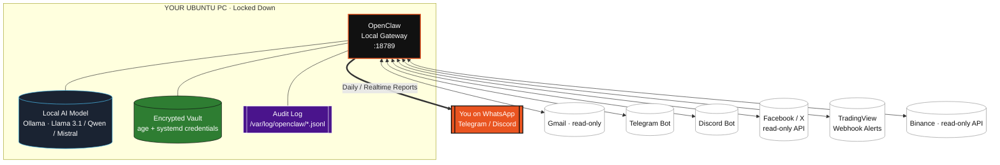

# OpenClaw — Ubuntu Hardened Gateway · Good → Better → BEST

> **Self-hosted. Always-on. Locked down by default.**
> A step-by-step, security-first blueprint to run [OpenClaw](https://docs.openclaw.ai/) on YOUR Ubuntu PC as a private AI gateway to Gmail, Telegram, Discord, WhatsApp, Facebook/X, TradingView & Binance — without handing the keys to the kingdom on day one.

[](https://ubuntu.com)
[](https://docs.openclaw.ai)
[](LICENSE)
[](SECURITY.md)

---

### TL;DR Philosophy

**OpenClaw is free & open-source — the AI model is not necessarily free.** We self-host the gateway on your hardware, start with `read-only + allowlist` everywhere, and escalate permissions one channel at a time *after* you verify it works. This repo is the checklist that prevents "oops it traded my portfolio at 3am."

Original idea by you — this repo makes it **Good → Better → Best**.

| Tier | Name | What changes | For whom |
| :--- | :--- | :--- | :--- |
| **GOOD** | Works | Gateway runs, 1 channel (Telegram), local logs | You want it running today |
| **BETTER** | Hardened | 24/7 systemd + allowlists + local Ollama + encrypted secrets | You want it private & private-model |
| **BEST** | Autonomous | All channels, scheduled monitors, daily WhatsApp report, auto-recovery, audit trail | You want a real assistant |

You **never skip tiers.** Each tier is a gate.

---

## Architecture — What We're Building



**Key design decisions:**

1.  **Gateway is local-only.** It binds to `127.0.0.1:18789` and is never exposed to the internet directly. Remote access via SSH tunnel or Tailscale only.
2.  **Least privilege.** Every channel starts `disabled` → `read-only` → `scoped write` only after you approve.
3.  **Allowlist, not blocklist.** The agent can *only* run commands/files you explicitly list in `config/allowlist.yaml`.
4.  **Local model by default.** Cloud models are opt-in per task. No bill shock, no data exfiltration.
5.  **Everything audited.** Every tool call + channel message is `jsonl` logged.

> OpenClaw can execute commands and interact with connected accounts, so start conservative and use allowlists. — [OpenClaw Docs](https://docs.openclaw.ai/start/openclaw)

---

## The 14-Step Plan (Locked-Down Order)

Do not parallelize. Do not skip.

| Step | Stage | Doc | Gate to pass |
| :--- | :--- | :--- | :--- |
| **0** | Philosophy & Threat Model | `SECURITY.md` | You can explain what the agent CAN'T do |
| **1** | **System Check (DO THIS NOW)** | `docs/01-system-check.md` | `scripts/step1-system-check.sh` all green |
| 2 | Install OpenClaw Gateway | `docs/02-install.md` | `openclaw health` = OK, no error |
| 3 | 24/7 Systemd Service | `docs/03-service-24-7.md` | Survives `sudo reboot` |
| 4 | Local AI Model (Ollama) | `docs/04-local-model.md` | `ollama run llama3.1` answers offline |
| 5 | **WhatsApp** (reports) | `docs/05-channels-whatsapp.md` | QR paired, test report arrives |
| 6 | Telegram | `docs/06-channels-telegram-discord.md` | Bot replies in DM, not group |
| 7 | Discord | same | Bot in 1 private test server |
| 8 | Gmail (read-only OAuth) | `docs/07-channels-gmail.md` | `label:openclaw-test` read works |
| 9 | Facebook / X (if API permits) | `docs/08-channels-social.md` | Read-only fetch succeeds |
| 10 | TradingView Webhook | `docs/09-tradingview-binance.md` | Test alert → Telegram |
| 11 | Binance (read-only) | same | `balance` read, trade blocked |
| 12 | Schedulers & Reports | `docs/10-automation-reports.md` | Daily 09:00 WhatsApp digest |
| 13 | Harden & Back up | `docs/11-hardening.md` | `scripts/harden.sh` pass |
| 14 | Reboot & Recovery Test | `docs/12-recovery.md` | Pull-the-plug test passes |

> Why this order? WhatsApp last? No — **WhatsApp is reports-only (step 5)** so you see failures early, but you don't enable *actions* until after observability is ready.

---

## STEP 1 — Check Your Ubuntu PC (Do Only This Now)

> You asked to do only this step before installing anything. This repo makes it foolproof.

### Option A — One-liner (recommended)

Copy-paste **one** command — it runs all 7 checks, prints a human report + saves `~/openclaw-system-report.json`:

```bash
curl -fsSL https://raw.githubusercontent.com/cloudshome/Agent/main/scripts/step1-system-check.sh | bash
# or if you cloned:
./scripts/step1-system-check.sh
```

### Option B — Manual (what you wrote)

Open **Terminal** and run *one at a time* — paste output into an issue if you want help:

```bash
lsb_release -a
uname -m
node --version
npm --version
free -h
lscpu | grep -E 'Model name|CPU\(s\)'
df -h /
```

**What we check & why:**

| Command | What it tells us | GOOD | BETTER | BEST |
| :--- | :--- | :--- | :--- | :--- |
| `lsb_release -a` | Ubuntu 22.04 / 24.04 LTS? | 20.04+ ok | 22.04 LTS | 24.04 LTS |
| `uname -m` | `x86_64` or `aarch64`? | either | `x86_64` | `x86_64` + AVX2 |
| `node --version` | >=18? | `18.x` | `20.x LTS` | `22.x LTS` |
| `npm --version` | >=9? | `9+` | `10+` | `10+` |
| `free -h` | RAM for local LLM | 4 GB (tiny) | 16 GB (7B) | 32 GB+ (70B) |
| `lscpu` | CPU for inference | 2 core | 4 core + AVX512 | 8 core+ / GPU |
| `df -h /` | Disk for models | 20 GB free | 50 GB | 100 GB + NVMe |

The script will tell you **which local models you can actually run** — no guessing.

➡️  **Full guide:** `docs/01-system-check.md` (screenshots, troubleshooting, upgrade commands)

### After Step 1

Paste the output (or `cat ~/openclaw-system-report.json`) into a GitHub Issue / tell the agent. **We will not proceed to Step 2 until Step 1 is green.** That's the lock-down discipline.

---

## Quick Start (after Step 1 passes)

```bash
git clone https://github.com/cloudshome/Agent.git && cd Agent

# 1. verify
./scripts/step1-system-check.sh

# 2. install gateway (idempotent, does not enable channels)
./scripts/install-openclaw.sh

# 3. make it 24/7
sudo ./scripts/setup-service.sh

# 4. local model
./scripts/setup-ollama.sh  # installs Ollama + pulls llama3.1:8b if RAM allows

# check health
openclaw health
openclaw logs --tail 50
systemctl status openclaw-gateway --no-pager
```

---

## Security Defaults (BEST tier)

These are **on by default** in `config/openclaw.yaml.example` (post-audit fix for `trusted_proxies_missing`):

```yaml
gateway:
  bind: "127.0.0.1"
  port: 18789
  expose: false              # never 0.0.0.0
  trusted_proxies: []        # ← explicit [] = audit warning cleared (use ["127.0.0.1","::1"] behind Nginx/Caddy)

security:
  mode: "paranoid"
  allowlist: "./config/allowlist.yaml"  # ONLY these commands/paths
  deny_by_default: true
  require_approval_for: [ "exec", "write", "trade", "send" ]

channels:
  whatsapp:
    enabled: false           # enable after QR + dedicated number (recommended)
    mode: "report-only"
  telegram: { enabled: false, allowFrom: ["<YOUR_TG_ID>"] }
  discord:  { enabled: false, allowGuilds: ["<TEST_GUILD_ID>"] }
  gmail:    { enabled: false, scope: "readonly" }
  binance:  { enabled: false, scope: "readonly", canTrade: false }
```

> **Live note (2026-08-10):** Gateway is **loopback-only** (`127.0.0.1`), **dashboard connected**, **token auth OK**, **0 critical** — only `trusted_proxies_missing` remains as low warning until you set `trusted_proxies: []`. See visual: `dashboard/index.html`.

**Systemd hardening:** `systemd/openclaw-gateway.service` is the **safe** profile (no `218/CAPABILITIES`). Paranoid (with `RestrictNamespaces`/`SystemCallFilter`) is kept as `systemd/openclaw-gateway.paranoid.service` — **not active** by design.

See `SECURITY.md` for threat model, credential storage (`age` + `systemd-creds`), and allowlist recipes.

### WhatsApp Note

OpenClaw uses **WhatsApp Web / Baileys with QR pairing**. Use a **dedicated number** for the assistant — personal self-chat is supported but not recommended for 24/7. ([OpenClaw — WhatsApp](https://docs.openclaw.ai/channels/whatsapp))

---

## Repo Layout

```
.
├── README.md                 # you are here — Good → Better → Best
├── SECURITY.md               # threat model & hardening checklist
├── ROADMAP.md                # full visual roadmap (you are here → BEST)
├── dashboard/
│   └── index.html            # LIVE visual status (loopback/token/0 critical)
├── docs/
│   ├── 00-architecture.md
│   ├── 01-system-check.md    # STEP 1 deep dive
│   ├── 02-install.md
│   ├── 03-service-24-7.md
│   ├── 04-local-model.md
│   └── ... (14 steps total)
├── scripts/
│   ├── step1-system-check.sh # ← RUN THIS FIRST
│   ├── install-openclaw.sh
│   ├── setup-service.sh
│   ├── harden.sh
│   └── healthcheck.sh
├── config/
│   ├── openclaw.yaml.example # trusted_proxies: [] fix included
│   ├── allowlist.example.yaml
│   └── .env.example
└── systemd/
    ├── openclaw-gateway.service              # SAFE (active)
    └── openclaw-gateway.paranoid.service    # PARANOID (experimental, off)
```

---

## Troubleshooting Step 1

| Symptom | Fix |
| :--- | :--- |
| `lsb_release: command not found` | `sudo apt update && sudo apt install lsb-release -y` |
| `node: command not found` | Use `nvm` or `sudo apt install nodejs` — need >=18 |
| `free` shows <2GB | No local 7B model — use 3B (`qwen2:1.5b`) or cloud fallback |
| `df` <10GB free | `sudo apt autoremove --purge && sudo journalctl --vacuum-time=7d` |

More: `docs/01-system-check.md#troubleshooting`

---

## Contributing

This is your private gateway — PRs should keep the "locked down by default" invariant. See `CONTRIBUTING.md`.

---

## References

- [OpenClaw Docs](https://docs.openclaw.ai/)
- [Personal assistant setup — conservative access](https://docs.openclaw.ai/start/openclaw)
- [Linux Gateway / Daemon](https://docs.openclaw.ai/)
- [WhatsApp Channel](https://docs.openclaw.ai/channels/whatsapp)
- [Ollama](https://ollama.com)

---

**Next action:** Run `./scripts/step1-system-check.sh` and share the report. We install nothing until that's green.

> Built step by step. Locked down at every step. — OpenClaw on Ubuntu

