# ROADMAP — From Zero to BEST (Visual, Locked-Down)

> **You are here:** Gateway live, dashboard connected, loopback-only, `0 critical` — one low warning (`trusted_proxies_missing`) already fixed in example. Paranoid systemd stays off (it caused `218/CAPABILITIES`).  
> This roadmap carries you **all the way** — step by step, no skipping, with a gate you must pass before the next step.

**Branch:** `arena/019fe7c1-agent` · **Date:** 2026-08-10 Asia/Dhaka · **Visual:** `dashboard/index.html` → https://8787-iune7t4ul3jmyjc7x7gdo.e2b.app

---

## 0 — Where we stand (visual live check)

```mermaid
flowchart LR
    U[[You]] --> DASH[Dashboard<br/>token OK] --> GW[Gateway<br/>127.0.0.1:18789<br/>0 critical]
    GW --- P{{trusted_proxies: []<br/>fix in example}}
    GW --- SAFE[systemd SAFE<br/>No 218]
    GW -.-> X[PARANOID OFF<br/>experimental]
    GW <--> MODEL[(Ollama<br/>next)]
    GW <-.-> CH[Channels<br/>all disabled<br/>enable 1-by-1]

    classDef ok fill:#22C55E,stroke:#000,color:#000
    classDef warn fill:#F59E0B,stroke:#000,color:#000
    classDef off fill:#444,stroke:#888,color:#fff
    classDef gw fill:#E95420,stroke:#000,color:#fff

    class GW,DASH,SAFE ok
    class P warn
    class X off
```

| Check | State | Evidence |
| :--- | :--- | :--- |
| Gateway | ✔ running | `systemctl status openclaw-gateway` · `active` |
| Dashboard | ✔ connected | token handshake OK |
| Token auth | ✔ working | gateway token verified |
| Network | ✔ loopback-only | `bind: "127.0.0.1"` · `expose:false` · never `0.0.0.0` |
| Audit | ✔ 0 critical · 1 low | `trusted_proxies_missing` → fix: `trusted_proxies: []` |
| Systemd | ✔ safe active, paranoid off | `systemd/openclaw-gateway.service` (safe) · `*.paranoid.service` not enabled |

---

## The 14 Gates — Good → Better → Best

> **Rule:** Never enable `write`/`trade`/`exec` on this step until the gate says PASS.

| # | Tier | Stage | You do (1 command) | Gate (must be green) | Time |
| :--- | :--- | :--- | :--- | :--- | :--- |
| **0** | — | Philosophy | Read `SECURITY.md` + this roadmap | You can explain what the agent **can't** do | 10 min |
| **1** | **GOOD** | **System Check** | `./scripts/step1-system-check.sh` | All 7 checks PASS/WARN, 0 FAIL · `~/openclaw-system-report.json` saved | 2 min |
| 2 | GOOD | Install Gateway | `./scripts/install-openclaw.sh` | `openclaw health` = ok · `config/openclaw.yaml` has `deny_by_default:true` | 3 min |
| 3 | GOOD | 24/7 Systemd | `sudo ./scripts/setup-service.sh` | `systemctl status` active · survives `sudo reboot` | 3 min |
| 4 | **BETTER** | Local Model | `curl -fsSL https://ollama.com/install.sh \| sh && ollama pull llama3.1:8b` | `ollama run llama3.1:8b "hi"` offline | 10 min |
| 5 | BETTER | WhatsApp reports | QR pair (dedicated number) | `openclaw channels whatsapp send --test` arrives | 5 min |
| 6 | BETTER | Telegram | `@BotFather` → token → `allowFrom: [you]` | DM `/start` replies, group still empty | 5 min |
| 7 | BETTER | Discord | Dev Portal → 1 test guild | Bot in 1 guild only | 5 min |
| 8 | BETTER | Gmail read-only | OAuth `credentials.json` → `scope:readonly` `label:openclaw-test` | `gmail list --limit 3` works, send blocked | 10 min |
| 9 | GOOD | Facebook/X | Read-only tokens if available | `fetch` works or documented as not feasible | 10 min |
| 10 | BETTER | TradingView | `TV_WEBHOOK_SECRET` + tunnel | Test webhook → Telegram notify (no trade) | 10 min |
| 11 | BETTER | Binance | **Read-only** API key, `canTrade:false`, `testnet:true` | `balance` works, `trade --dry-run` denied | 10 min |
| 12 | **BEST** | Schedulers & Reports | Enable `automation.schedulers` | Daily 09:00 WhatsApp digest arrives | 5 min |
| 13 | BEST | **Harden** | `./scripts/harden.sh` → fix → pass | `✔ Hardened — BEST tier` (now includes `trusted_proxies`) | 5 min |
| 14 | BEST | **Reboot Test** | `sudo reboot` → `systemctl status` `openclaw health` `curl :18789/health` | All 4 checks green within 10s of boot | 5 min |

**Total hands-on:** ~90 min spread across days — do 1–2 gates per session.

---

## Gate details — what to run, what to see

### 0 · Philosophy (do now, 10 min)
- Read `SECURITY.md` (5 Laws: deny-by-default, allowlist, read-only-first, no secrets in git, audit everything).
- Understand: every channel starts `enabled:false`, agent can only run `config/allowlist.yaml`.

### 1 · System Check — **DO ONLY THIS BEFORE INSTALL**
One-liner (no clone):
```bash
curl -fsSL https://raw.githubusercontent.com/cloudshome/Agent/main/scripts/step1-system-check.sh | bash
# or cloned: ./scripts/step1-system-check.sh
```
- Saves `~/openclaw-system-report.json` (no secrets) + `.md`.
- Tells you which Ollama model fits your RAM (0.5B–70B).
- **Gate:** `0 FAIL` (WARN is okay, FAIL must be fixed). Paste JSON into an Issue if stuck.

### 2 · Install Gateway — after Step 1 green
```bash
./scripts/install-openclaw.sh  # idempotent, never overwrites config
openclaw --version && openclaw health
grep -q 'deny_by_default: true' config/openclaw.yaml && echo "✔ locked down"
```

### 3 · 24/7 Systemd — SAFE profile (why we split)
```bash
sudo ./scripts/setup-service.sh  # installs systemd/openclaw-gateway.service (SAFE)
systemctl status openclaw-gateway --no-pager
# safe = NoNewPrivileges+PrivateTmp+ProtectSystem, but NO RestrictNamespaces/SystemCallFilter → no 218/CAPABILITIES
# paranoid profile is kept as systemd/openclaw-gateway.paranoid.service — NOT enabled, for reference only
```

### 4 · Local Model — no API bill
See `docs/04-local-model.md`. RAM → model table is in Step 1 report.

### 5 · WhatsApp — reports-only first
Dedicated number recommended ([Baileys/WhatsApp Web QR](https://docs.openclaw.ai/channels/whatsapp)). Start `mode: report-only`.

### 6–7 · Telegram/Discord — DM / 1 guild only
Telegram: `allowFrom: ["<YOUR_TG_ID>"]` `allowGroups: []`. Discord: `allowGuilds: ["<TEST_GUILD_ID>"]`.

### 8 · Gmail — read-only, narrow label
```yaml
channels.gmail.scope: readonly
channels.gmail.label_filter: "label:openclaw-test"  # not INBOX
```

### 9 · Facebook/X — often not feasible, okay to skip
If API review is blocked, document as `not feasible` and use RSS instead.

### 10–11 · TradingView + Binance — money = read-only until harden passes
TradingView webhook needs `TV_WEBHOOK_SECRET` + tunnel, never open firewall. Binance key: **read-only, no withdraw, IP-locked, testnet:true, daily_trade_limit:0, canTrade:false**.

### 12 · Schedulers & Reports — your daily 09:00 digest
```yaml
automation.schedulers: [{id: daily-report, cron: "0 9 * * *", actions: ["report --to whatsapp"]}]
```
Monitors: `gmail-urgent` → Telegram high priority.

### 13 · Harden — now including `trusted_proxies`
```bash
./scripts/harden.sh        # audit (now checks trusted_proxies, allowlist.example fallback)
./scripts/harden.sh --fix  # fixes .gitignore / perms
./scripts/harden.sh        # goal: ✔ Hardened — BEST tier
# Checklist: bind 127.0.0.1, UFW 22 only, .env 600 + .env.age, allowlist ≤10, canTrade:false, WhatsApp dedicated
```

### 14 · Reboot — the pull-the-plug test
```bash
sudo reboot
systemctl status openclaw-gateway --no-pager
openclaw health
curl -fsS http://127.0.0.1:18789/health
```

---

## Visual timeline

```mermaid
gantt
    title OpenClaw — Good → Better → Best (gated)
    dateFormat  X
    axisFormat %s
    section GOOD
    1 System Check       :done, 0, 1
    2 Install            :done, 1, 2
    3 Systemd SAFE       :done, 2, 3
    section BETTER
    4 Local Model        :active, 3, 4
    5 WhatsApp           : 4, 5
    6 Telegram           : 5, 6
    7 Discord            : 6, 7
    8 Gmail ro           : 7, 8
    9 FB/X               : 8, 9
    10 TradingView       : 9, 10
    11 Binance ro        : 10, 11
    section BEST
    12 Reports           : 11, 12
    13 Harden            : 12, 13
    14 Reboot            : 13, 14
```



---

## Security — locked down at every gate

- **Gateway:** `127.0.0.1`, `expose:false`, `trusted_proxies: []` (explicit)
- **Access:** `deny_by_default:true` + `config/allowlist.yaml` (≤10 exec entries, `deny: ["*"]`)
- **Channels:** all `enabled:false` → `readonly` → `scoped write` only after audit
- **Secrets:** `config/.env` (600, gitignored) → `age` encrypted `.env.age` → `systemd LoadCredentialEncrypted` (BEST)
- **Audit:** `/var/log/openclaw/audit.jsonl` + `journalctl -u openclaw-gateway`
- **UFW:** `22/tcp` only, no gateway port
- **Money:** `canTrade:false` until harden PASS + `require_approval_for: ["trade"]`

Full law: `SECURITY.md`.

---

## Dashboard — live visual

- **File:** `dashboard/index.html`
- **Live preview:** `https://8787-iune7t4ul3jmyjc7x7gdo.e2b.app` (while this sandbox lives)
- **Shows:** 4 green cards (gateway/dashboard/token/loopback), 0 critical / 1 low with before/after fix, safe vs paranoid diff, Mermaid architecture, next 4 steps.

Open it after every gate to confirm you’re still green.

---

## Next actions — carry me with you

1. **Now (1 min):** Copy `trusted_proxies: []` from dashboard → `config/openclaw.yaml` on next reload (no restart needed to view).
2. **Next session:** Step 4 — Ollama local model (pick from Step 1 RAM hint).
3. **Then:** Enable WhatsApp dedicated number QR → 1 channel at a time.

> We never skip tiers. Every upload to GitHub (this branch `arena/019fe7c1-agent`) is a checkpoint.

---

## Upload checklist (before end of session)

- [x] `README.md` — trusted_proxies fix + safe/paranoid note + roadmap link
- [x] `config/openclaw.yaml.example` — `trusted_proxies: []`
- [x] `systemd/openclaw-gateway.service` (SAFE, no 218) + `*.paranoid.service` (experimental)
- [x] `scripts/harden.sh` — now audits `trusted_proxies` + allows `.example` fallback
- [x] `dashboard/index.html` — live visual
- [x] `ROADMAP.md` — this file (carries you to BEST)
- [ ] `git push origin arena/019fe7c1-agent` — done at session end (you are reading the pushed version)

**How to verify upload:**
```bash
git log --oneline --all --graph | head
git ls-remote origin | grep arena
curl -fsSL https://raw.githubusercontent.com/cloudshome/Agent/arena/019fe7c1-agent/ROADMAP.md | head
```

---

Built step by step. Locked down at every step. — OpenClaw on Ubuntu
